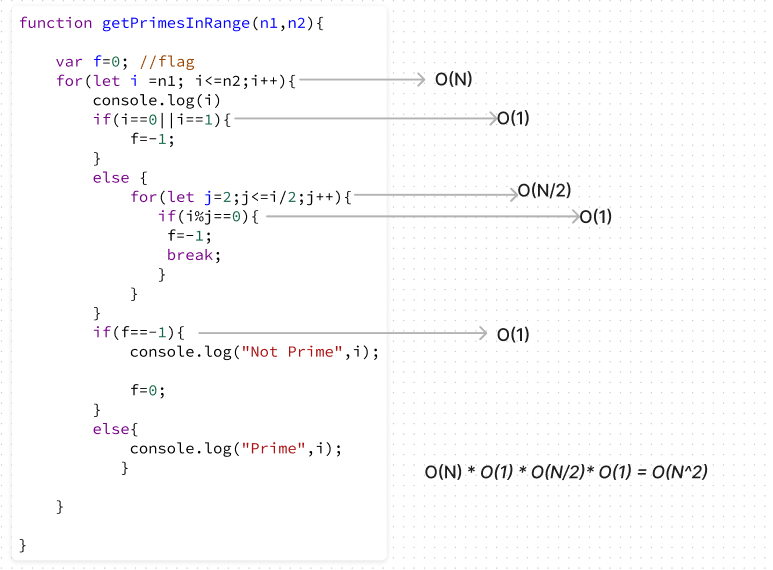
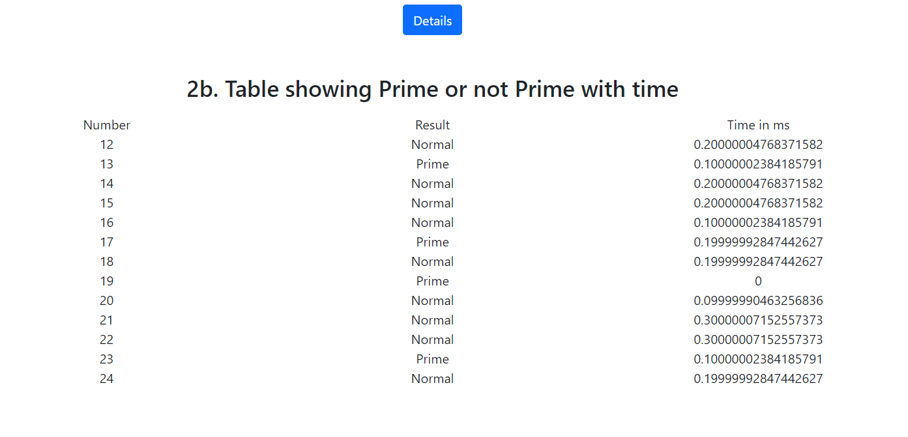
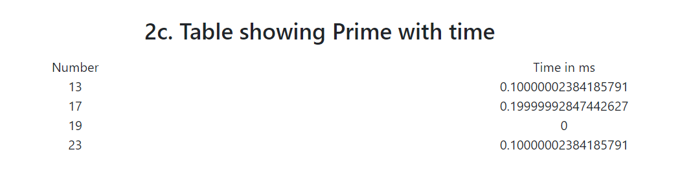
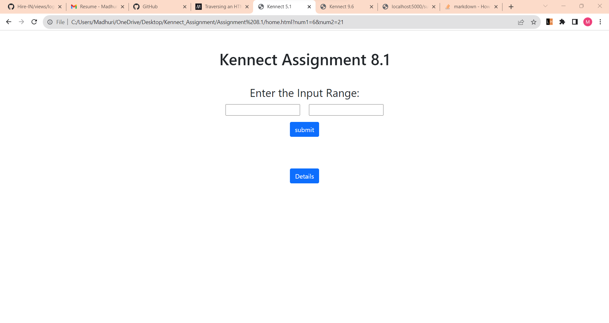
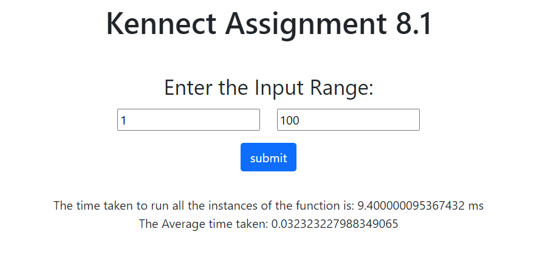
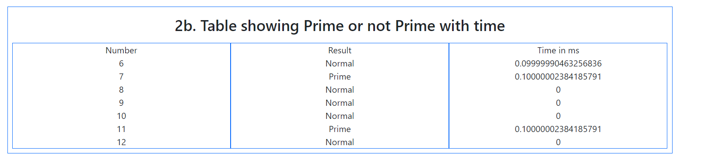

# Assignment 8.1
Write a function 'getPrimes' using JS to return all the prime number in a given input range
## 1. Comment on time and space complexity of the program
The Time Complexity of the 'getPrimes' js program is O(N^2) because of the nested for loop while Space Complexity of the program in O(1) 

## 2. Find out the metrics about the performance of the function
 a. Time taken to execute getPrime function (for input range 1 to 100)
 

 b. Check number Prime or Not prime (range 12 to 24)

 c. Time taken to execute prime Numbers
 

 d. Average time take to exectue a range
 
 

## 3. Design a UI Wireframe for displaying above information in most efficient way
Designed using Figma

## 4. Implement a plain HTML-CSS page to display above info in specified way
 a. Two Input boxes to take range for input

 b. Show 2a. and 2b. in main result

 c. A button in main result called deatils 
 
 
 
 d. Onclick button, open a pop-up and show 2b. and 2c. in two tabs each  
 
 
